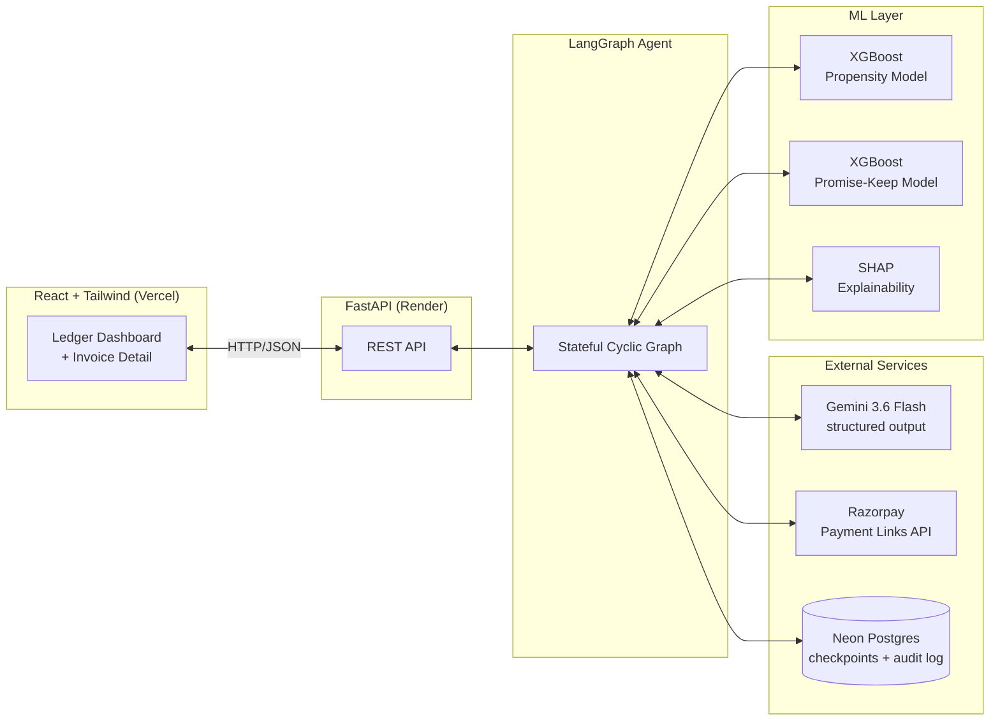
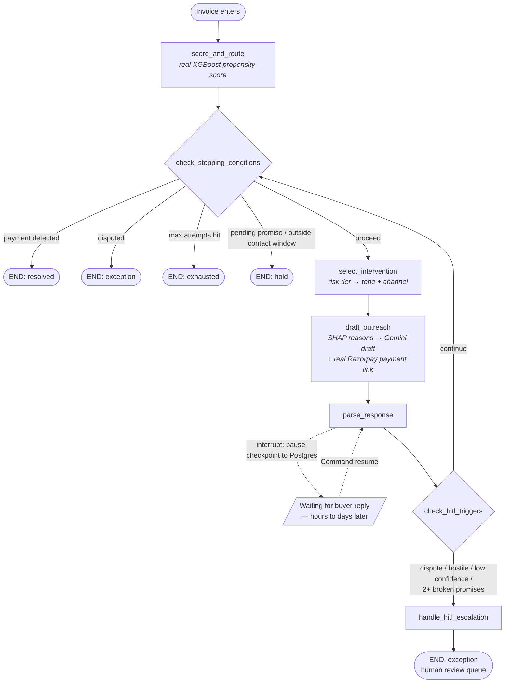

# Chaser — AI-Native B2B Accounts Receivable Agent

**An autonomous, compliance-first agent that chases overdue B2B invoices — scoring risk, drafting outreach, extracting buyer intent from replies, and escalating to a human when it should, not when it's convenient.**

Built solo for the Razorpay AI Buildathon 2026 (Track 03 — AI Revenue Recovery).

---

## Why this exists

Razorpay's own shipped Agent Studio agents (Abandoned Cart, Subscription Recovery, Dispute Responder) are all **D2C**. Razorpay's newly-launched [Vulcan](https://www.razorpay.com) foundation model optimizes whether a _consumer_ payment succeeds in the moment. Nothing addresses **B2B receivables** — whether a business invoice gets paid _at all_, weeks before it's even overdue enough to matter.

Chaser is that white space: a propensity model that predicts which invoices will go late, an LLM agent that chases them with context-aware, explainable outreach, and a hard compliance layer that stops the agent — not the model — from ever acting outside policy.

---

## System architecture



## Agent state graph

The core of the system — a genuinely cyclic LangGraph state machine, not a linear pipeline. Stopping-rule enforcement happens in plain code **before** the LLM is ever invoked; the model never gets a chance to decide whether to honor a compliance rule.



**The loop**: `parse_response → check_hitl_triggers → continue → check_stopping_conditions` is real — an invoice can cycle through multiple contact attempts, each one re-evaluated against every stopping rule, until it resolves, exhausts, or gets escalated.

---

## What's real, not simulated

| Component                   | Detail                                                                                                                                                                           |
| --------------------------- | -------------------------------------------------------------------------------------------------------------------------------------------------------------------------------- |
| **Propensity model**        | XGBoost, leakage-safe expanding-window features, temporal train/test split. **AUC-PR 0.755** vs. 0.382 naive baseline (+98% lift)                                                |
| **Promise-keep model**      | Second XGBoost model on simulated promise outcomes, explicitly documented as a modest secondary signal (AUC-ROC 0.573), not a primary decision driver                            |
| **Explainability**          | Real per-invoice SHAP values, translated to plain language for buyer-facing copy — raw feature names never reach the customer                                                    |
| **LLM**                     | Real Gemini API calls (structured output, Pydantic-validated, retry-on-failure) for both drafting outreach and extracting intent from replies                                    |
| **Async human-in-the-loop** | Real `interrupt()`/`Command(resume=...)` — the graph genuinely pauses and can resume **hours or days later, in a completely separate process**, backed by Postgres checkpointing |
| **Payment integration**     | Real Razorpay test-mode Payment Links, cached per-invoice to respect the 30-link test cap, embedded directly in drafted messages                                                 |
| **Audit trail**             | SHA-256 hash-chained log — tampering with any entry breaks the chain from that point forward, verifiable end-to-end                                                              |
| **Persistence**             | Postgres (Neon), not local files — survives redeploys and cold starts                                                                                                            |

---

## Compliance layer

- **Stopping rules evaluated in plain code, before the LLM runs**: payment detected → resolved; disputed → immediate stop; max attempts → exhausted; pending promise or outside contact window → hold (no re-contact)
- **HITL escalation** (4 triggers): disputed language, hostile tone, low extraction confidence, 2+ consecutive broken promises
- **Hash-chained audit log**: every node transition logged with a verifiable SHA-256 chain, deliberately separate from LLM-facing dev tracing — this is the compliance system of record

---

## Eval harness

5 adversarial personas run against the **real graph** — real Gemini calls, real Postgres, real interrupt/resume, no mocking:

| Persona             | Tests                                                                                  | Result  |
| ------------------- | -------------------------------------------------------------------------------------- | ------- |
| **Cooperative**     | Extracts a clean promise, computes promise-keep score, correctly halts (no re-contact) | ✅ PASS |
| **Evasive**         | Does not hallucinate a firm commitment from vague language                             | ✅ PASS |
| **Disputer**        | Extracts dispute, escalates via HITL, does not proceed automatically                   | ✅ PASS |
| **Serial-promiser** | Escalates on 2+ broken promises, even mid-new-promise                                  | ✅ PASS |
| **Silent**          | Retries up to `max_attempts` with no reply, then reaches `exhausted`                   | ✅ PASS |

**5/5 passing.** The harness found and fixed 2 real bugs during development: a dead-end for genuinely silent buyers (no path to `exhausted` existed), and a streak-counting bug where a fresh pending promise masked an already-broken pattern underneath it.

---

## Known limitations (documented, not hidden)

- **Categorical feature mismatch**: `business_code`/`invoice_currency` were fit on Kaggle's US/CA training distribution — India synthetic invoices get all-zero dummies for these. `customer_late_rate_feat` (39% of model gain) and other numeric features still carry real signal. A retrain on blended data is scoped but not built.
- **Razorpay test-mode cap**: transactions above ~₹5L get no real payment link; the agent falls back to UTR-based instructions instead of crashing.
- **Promise resolution**: nothing yet evaluates whether a promise was actually kept once `promised_date` passes — no scheduled job exists for this (real future work).
- **`/run` endpoint**: only cleanly supports invoices never run before; retrying a "held" (not interrupted) invoice on the next contact window isn't a built flow yet.

---

## Project structure

```
├── src/
│   ├── data/           # schema.py — normalized Pydantic models
│   ├── adapters/        # Kaggle, synthetic (India/Faker), Razorpay
│   ├── features/        # leakage-safe feature engineering
│   ├── models/           # propensity + promise-keep training, SHAP/calibration
│   ├── agent/
│   │   ├── state.py       # LangGraph TypedDict state
│   │   ├── graph.py        # the cyclic state machine
│   │   ├── inference.py     # single-invoice scoring + SHAP
│   │   ├── bridge.py         # Invoice <-> InvoiceState
│   │   ├── event_log.py       # Postgres-backed event log
│   │   ├── audit_log.py        # SHA-256 hash-chained log
│   │   ├── db.py                # Postgres connection + schema
│   │   ├── llm_utils.py          # Gemini structured-output wrapper
│   │   └── nodes/                 # stopping, intervention, draft_outreach,
│   │                                 parse_response, hitl
│   ├── eval/
│   │   └── persona_harness.py      # 5-persona adversarial eval suite
│   └── api/
│       └── main.py                  # FastAPI REST layer
├── chaser-frontend/       # React + Tailwind (Vite)
├── configs/policy.yaml     # risk tiers, stopping rules, HITL thresholds
└── docs/                    # ADRs, compliance framing
```

---

## Setup

### Backend

```bash
pip install -r requirements.txt
```

`.env`:

```
DATABASE_URL=postgresql://...          # Neon
GEMINI_API_KEY=...
RAZORPAY_KEY_ID=...
RAZORPAY_KEY_SECRET=...
# AGENT_TEST_MODE_SKIP_CONTACT_WINDOW=1  # local testing ONLY — never in production
```

```bash
python -c "from src.agent.db import init_schema; init_schema()"  # one-time
uvicorn src.api.main:app --reload
```

### Frontend

```bash
cd chaser-frontend
npm install
cp .env.example .env.local   # set VITE_API_BASE_URL
npm run dev
```

### Eval harness

```bash
python -m src.eval.persona_harness
```

---

## API reference

| Endpoint                   | Method | Purpose                                                                |
| -------------------------- | ------ | ---------------------------------------------------------------------- |
| `/api/invoices`            | GET    | List all invoices with real scores + derived status                    |
| `/api/invoices/{id}`       | GET    | Full detail: state, SHAP reasons, audit trail, drafts, promise history |
| `/api/invoices/{id}/run`   | POST   | Trigger the agent on an unrun invoice                                  |
| `/api/invoices/{id}/reply` | POST   | Resume a paused invoice with a buyer reply                             |

---

## Tech stack

**ML**: XGBoost, SHAP, scikit-learn, pandas
**Agent**: LangGraph (stateful graphs, checkpointing, `interrupt()`/`Command`), Gemini API
**Backend**: FastAPI, Postgres (Neon), psycopg
**Frontend**: React, Tailwind CSS v4, Vite
**Integrations**: Razorpay Payment Links API
**Deploy**: Render (backend), Vercel (frontend)

---

## Roadmap

- Retrain propensity model on blended Kaggle + India synthetic data (ADR-0005)
- Scheduled job to evaluate promise-keep outcomes once `promised_date` passes
- Razorpay Invoices API (currently Payment Links only)
- Retry scheduler for invoices held on `outside_contact_window`
